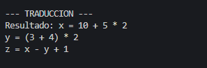
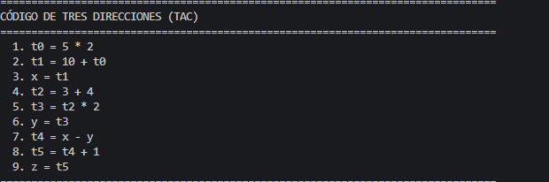
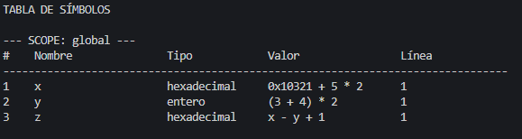

# Analizador Sintáctico LL(1) con Generación de Código de Tres Direcciones


##  Características

- **Parser LL(1)**: Análisis sintáctico descendente predictivo
- **Lexer completo**: Reconocimiento de identificadores, números (enteros, decimales, hexadecimales, octales, binarios), operadores y delimitadores
- **Acciones semánticas**: Construcción de traducciones durante el análisis
- **Tabla de símbolos**: Gestión de variables con alcances jerárquicos
- **Generador TAC**: Conversión de expresiones a código de tres direcciones
- **Visualización**: Impresión de árbol de análisis sintáctico


### Producciones

```
PROGRAMA -> SENTENCIAS

SENTENCIAS -> SENTENCIA SENTENCIAS_PRIMA

SENTENCIAS_PRIMA -> newline SENTENCIAS
                  | ε

SENTENCIA -> identificador SENTENCIA_ID
           | entero EXPRESION_REST
           | decimal EXPRESION_REST
           | hexadecimal EXPRESION_REST
           | octal EXPRESION_REST
           | binario EXPRESION_REST
           | parentesis_izq EXPRESION parentesis_der EXPR_PRIMA
           | opsuma FACTOR TERMINO_PRIMA EXPR_PRIMA
           | opresta FACTOR TERMINO_PRIMA EXPR_PRIMA

SENTENCIA_ID -> op_asignacion EXPRESION
              | EXPRESION_REST

EXPRESION_REST -> TERMINO_PRIMA EXPR_PRIMA

EXPRESION -> TERMINO EXPR_PRIMA

EXPR_PRIMA -> opsuma TERMINO EXPR_PRIMA
            | opresta TERMINO EXPR_PRIMA
            | ε

TERMINO -> FACTOR TERMINO_PRIMA

TERMINO_PRIMA -> opmult FACTOR TERMINO_PRIMA
               | opdiv FACTOR TERMINO_PRIMA
               | ε

FACTOR -> entero
        | decimal
        | hexadecimal
        | octal
        | binario
        | identificador
        | parentesis_izq EXPRESION parentesis_der
```


##  Acciones Semánticas

Las acciones semánticas construyen traducciones sintáctico-dirigidas usando la técnica de placeholder `_`:

### 1. PROGRAMA

```
PROGRAMA -> SENTENCIAS
{
    PROGRAMA.traduccion = SENTENCIAS.traduccion
}
```

### 2. SENTENCIAS

```
SENTENCIAS -> SENTENCIA SENTENCIAS_PRIMA
{
    si SENTENCIAS_PRIMA.traduccion != "" entonces
        SENTENCIAS.traduccion = SENTENCIA.traduccion + "\n" + SENTENCIAS_PRIMA.traduccion
    sino
        SENTENCIAS.traduccion = SENTENCIA.traduccion
}
```

### 3. SENTENCIAS_PRIMA

```
SENTENCIAS_PRIMA -> newline SENTENCIAS
{
    SENTENCIAS_PRIMA.traduccion = SENTENCIAS.traduccion
}

SENTENCIAS_PRIMA -> ε
{
    SENTENCIAS_PRIMA.traduccion = ""
}
```

### 4. SENTENCIA

```
SENTENCIA -> identificador SENTENCIA_ID
{
    si SENTENCIA_ID.es_asignacion entonces
        // Es una asignación: x = expr
        agregar_a_tabla_simbolos(identificador, SENTENCIA_ID.expresion)
        SENTENCIA.traduccion = identificador + " " + SENTENCIA_ID.operador + " " + SENTENCIA_ID.expresion
    sino
        // Es una expresión: x + y
        si SENTENCIA_ID.traduccion comienza con "_" entonces
            SENTENCIA.traduccion = reemplazar("_", identificador, SENTENCIA_ID.traduccion)
        sino
            SENTENCIA.traduccion = identificador + SENTENCIA_ID.traduccion
}

SENTENCIA -> numero EXPRESION_REST
{
    si EXPRESION_REST.traduccion comienza con "_" entonces
        SENTENCIA.traduccion = reemplazar("_", numero, EXPRESION_REST.traduccion)
    sino
        SENTENCIA.traduccion = numero + EXPRESION_REST.traduccion
}

SENTENCIA -> parentesis_izq EXPRESION parentesis_der EXPR_PRIMA
{
    si EXPR_PRIMA.traduccion != "" entonces
        SENTENCIA.traduccion = reemplazar("_", "(" + EXPRESION.traduccion + ")", EXPR_PRIMA.traduccion)
    sino
        SENTENCIA.traduccion = "(" + EXPRESION.traduccion + ")"
}

SENTENCIA -> opsuma FACTOR TERMINO_PRIMA EXPR_PRIMA
SENTENCIA -> opresta FACTOR TERMINO_PRIMA EXPR_PRIMA
{
    resultado = operador + FACTOR.traduccion
    si TERMINO_PRIMA.traduccion != "" entonces
        resultado = reemplazar("_", resultado, TERMINO_PRIMA.traduccion)
    si EXPR_PRIMA.traduccion != "" entonces
        resultado = reemplazar("_", resultado, EXPR_PRIMA.traduccion)
    SENTENCIA.traduccion = resultado
}
```

### 5. SENTENCIA_ID

```
SENTENCIA_ID -> op_asignacion EXPRESION
{
    SENTENCIA_ID.es_asignacion = verdadero
    SENTENCIA_ID.operador = "="
    SENTENCIA_ID.expresion = EXPRESION.traduccion
    SENTENCIA_ID.traduccion = "= " + EXPRESION.traduccion
}

SENTENCIA_ID -> EXPRESION_REST
{
    SENTENCIA_ID.es_asignacion = falso
    SENTENCIA_ID.traduccion = EXPRESION_REST.traduccion
}
```

### 6. EXPRESION_REST

```
EXPRESION_REST -> TERMINO_PRIMA EXPR_PRIMA
{
    resultado = "_"
    si TERMINO_PRIMA.traduccion != "" entonces
        resultado = reemplazar("_", resultado, TERMINO_PRIMA.traduccion)
    si EXPR_PRIMA.traduccion != "" entonces
        resultado = reemplazar("_", resultado, EXPR_PRIMA.traduccion)
    EXPRESION_REST.traduccion = resultado
}
```

### 7. EXPRESION

```
EXPRESION -> TERMINO EXPR_PRIMA
{
    si EXPR_PRIMA.traduccion == "" entonces
        EXPRESION.traduccion = TERMINO.traduccion
    sino
        EXPRESION.traduccion = reemplazar("_", TERMINO.traduccion, EXPR_PRIMA.traduccion)
}
```

### 8. EXPR_PRIMA

```
EXPR_PRIMA -> opsuma TERMINO EXPR_PRIMA
EXPR_PRIMA -> opresta TERMINO EXPR_PRIMA
{
    si EXPR_PRIMA[siguiente].traduccion == "" entonces
        EXPR_PRIMA.traduccion = "_ " + operador + " " + TERMINO.traduccion
    sino
        parte_derecha = reemplazar("_", TERMINO.traduccion, EXPR_PRIMA[siguiente].traduccion)
        EXPR_PRIMA.traduccion = "_ " + operador + " " + parte_derecha
}

EXPR_PRIMA -> ε
{
    EXPR_PRIMA.traduccion = ""
}
```

### 9. TERMINO

```
TERMINO -> FACTOR TERMINO_PRIMA
{
    si TERMINO_PRIMA.traduccion == "" entonces
        TERMINO.traduccion = FACTOR.traduccion
    sino
        TERMINO.traduccion = reemplazar("_", FACTOR.traduccion, TERMINO_PRIMA.traduccion)
}
```

### 10. TERMINO_PRIMA

```
TERMINO_PRIMA -> opmult FACTOR TERMINO_PRIMA
TERMINO_PRIMA -> opdiv FACTOR TERMINO_PRIMA
{
    si TERMINO_PRIMA[siguiente].traduccion == "" entonces
        TERMINO_PRIMA.traduccion = "_ " + operador + " " + FACTOR.traduccion
    sino
        parte_derecha = reemplazar("_", FACTOR.traduccion, TERMINO_PRIMA[siguiente].traduccion)
        TERMINO_PRIMA.traduccion = "_ " + operador + " " + parte_derecha
}

TERMINO_PRIMA -> ε
{
    TERMINO_PRIMA.traduccion = ""
}
```

### 11. FACTOR

```
FACTOR -> numero
FACTOR -> identificador
{
    FACTOR.traduccion = valor_del_token
}

FACTOR -> parentesis_izq EXPRESION parentesis_der
{
    FACTOR.traduccion = "(" + EXPRESION.traduccion + ")"
}
```

##  Generación de Código de Tres Direcciones

El generador TAC convierte expresiones aritméticas en código intermedio:

### Algoritmo

```
función generar_tac_expresion(expresion):
    si expresion es simple (literal o identificador) entonces
        retornar expresion
    
    # Procesar operadores con precedencia
    para cada nivel de precedencia (menor a mayor):
        buscar operador en expresión
        si se encuentra entonces
            dividir expresión en izquierda y derecha
            temp_izq = generar_tac_expresion(izquierda)
            temp_der = generar_tac_expresion(derecha)
            temp = nuevo_temporal()
            emitir(temp + " = " + temp_izq + " " + operador + " " + temp_der)
            retornar temp
    
    si expresion tiene paréntesis entonces
        extraer contenido entre paréntesis
        retornar generar_tac_expresion(contenido)
    
    retornar expresion

función generar_tac_asignacion(variable, expresion):
    temp = generar_tac_expresion(expresion)
    emitir(variable + " = " + temp)
```

### Ejemplo

**Entrada:**
```
x = 10 + 5 * 2
y = (3 + 4) * 2
z = x - y + 1
```

**Salida TAC:**
```
1. t0 = 5 * 2
2. t1 = 10 + t0
3. x = t1
4. t2 = 3 + 4
5. t3 = t2 * 2
6. y = t3
7. t4 = x - y
8. t5 = t4 + 1
9. z = t5
```

##  Uso

```bash
python main.py <archivo_gramatica> <archivo_codigo>
```

**Ejemplo:**
```bash
python main.py grammar_simple.txt test_tac.txt
```


##  Ejemplo Completo

**Archivo de entrada (`test_tac.txt`):**
```bash 
x = 10 + 5 * 2
y = (3 + 4) * 2
z = x - y + 1
```
# Salida



# Codigo de tres direcciones

# Tabla de simbolos
